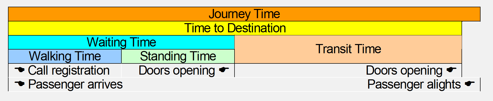

# 《电梯交通分析基本概念说明》（2014）

电梯交通分析的目的和意义

典型的交通流量图：（于首层大堂观察乘客出入电梯的情况）（所以后续分析要注意观察视角）

交通模式：

电梯交通系统指导标准：CIBSE Guide D - Transportation Systems in Buildings 2010

早高峰期间通常有五分钟的时间最为繁忙，按总人数的百分比来测量到达率arrival rate

电梯交通分析的两类方法：交通计算和交通模拟

交通模拟的定义：用计算机软件的随机发生器来模拟生成高峰期间的客流，载入到一个与实际电梯控制系统相同的调配运算模型里，通过软件来模拟一组电梯真实运行，最终对所有乘客的候梯时间和到达目的地时间作统计，求得平均值

交通模拟的结果：
- 五分钟载客需求（乘客到达率）：在 5分钟内电梯组需输送的乘客数与大楼内使用该组电梯的总人数之比，等同于乘客到达率(Arrival rate)，即5分钟内到达电梯厅的乘客人数与大楼内使用该组电梯的总人数之比。

- 平均候梯时间AWT
- 平均到达目的地时间ATTD：等待时间和运行时间总合

TKF对不同建筑物在不同交通模式下的设计建议：

# 《基于交通模式识别的电梯调度算法研究_李建民》 2007

电梯群控系统示意图：

电梯群控系统定义：电梯群控系统是将多台电梯组成梯群，由微机控制系统统一管理电梯群的召唤信号，根据系统设定的优化目标和建筑物中的实际交通情况，产生最优派梯方案的控制系统。

交通模式的识别对电梯群控系统调度算法的意义：\
一个对当前交通模式毫无知觉的电梯群控系统，不管客流强度的大小、客流密度的分布和客流流向的趋势而完全按照一种调度方法进行调度，这样的群控系统不可能在各种交通模式下满足系统要求的性能指标。
 
 
模糊神经网络的结构：\
输入层、模糊化层、规则层、综合层、输出层。第2、4层的节点是模糊子集节点，分别用于表示输入和输出变量的隶属函数。第三层每个节点代表一条规则，与2、4层的节点的连接代表模糊规则的特定组成。

本论文中所用的输入数据结构为（本五分钟内总客流量，进门厅人数，出门厅人数），比较简单。样本数据来源于专家经验，样本进行归一化处理。

训练过程：
* 从样本中获得隶属函数，应用改进的SOM方法进行学习
* 利用隶属函数从样本中获得模糊规则
* 用改进的误差反向传播方法优化调整隶属函数
* 应用网络对交通模式进行识别

得到交通模式后要针对不同交通模式进行对应调度算法的设计。此处论文中只是简单描述，没有给出具体的调度算法。

调度算法的设计其实是最优化评价函数:

AWT为平均候梯时间\
ART为平均乘梯时间\
CRD为电梯的拥挤程度\
ERC为电梯系统的能耗，可以根据电梯的启停次数来衡量

总结：所用算法和样本数据结构都比较简单，但提供了一些概念性的问题解释和调度算法的评价标准可以作为参考

# 《基于SVM的电梯群控系统交通流模式识别_李建民》2005

人工神经网络的方法：训练耗时、网络结构不可确定性、容易陷入局部极小化等问题。

支持向量机：将输入数据通过非线性函数映射到高维线性特征空间（如有必要），在此高维空间中构造出最优超平面。

本论文采用的是一对一的多值分类。即对于分k类的问题，构造k(k-1)/2的二值分类器，最后使用投票策略确定分类。

此论文中的样本数据也是根据专家经验来进行分类。

此论文中的样本数据结构同上，其他没有什么有效可参考信息。

# 《基于LSSVM的电梯交通模式的模糊识别_王鹿军》2012

把最小支持向量和模糊逻辑结合一起。

# 《Elevator Traffic Pattern Recognition Based on Density Peak Clustering》2018

使用聚类分析方法进行交通模式的识别：Density Peak Clustering

操作对象：passenger flow data

对于实时变化的数据使用五分钟内的人流数据

对电梯交通模式进行识别的意义

现有工作：
* fuzzy logic：没有考虑一些相关的输入数据比如时间和人流的到达率
* 二次loss function的SVM（least squares support vector machine ）：计算时间较长，不适合online的交通流识别

交通模式一般与建筑物类型有关，对于典型的办公大楼，主要交通模式有
* 上行高峰
* 下行高峰
* 午间交通
* 层间交通
* 空闲时段

聚类算法是数据挖掘的重要手段之一，主要有：
* 分区算法：K-means, K-medoids
* 基于图论的算法：spectral clustering
* 基于密度的算法：DBSCAN，VDBSCAN，Density Peak Clustering
    * DPC优点
        * 不需要指定聚类数目，且适应各种形状的cluster（同DBSCAN）
        * 更好的适应不同密度数据集的不同集群
        * 将不同的度量标准调整为距离
        * 是确定性算法不是迭代算法，计算量比较小
        * 可以提出噪音点
        
聚类算法常用的评测标准：轮廓系数（Silhouette Coefficient）

DPC参考文献：A.RodriguezandA.Laio,"Clusteringbyfastsearchandfindofdensity peaks," Science, vol. 344, no. 6191, pp. 1492-1496, 2014.

总结：本论文中使用到的样本数据结构是（enter flow，exit flow，interlayer flow），以五分钟加和为一个样本点，为本项目的数据预处理提供了一个可能的思路，不过此论文处理方法较为简单，提供简单借鉴。其次用非监督学习的聚类方法也并不需要对这几种交通模式进行具体数值上的定义。？

# 《群控电梯交通流预测与调度策略研究_项桂萍》 2012

## 目的层呼叫派梯引导

是指乘客在进入电梯前就选择目的层，与主流电梯不同，但仍具有参考意义。

## 基于神经网络的群控电梯交通流的预测

难点在于电梯交通的非线性和不确定性。

为什么要进行预测而不是直接的判断：仅仅实时识别交通模式会导致时间的滞后控制，从而达不到最优调度的目的，必须利用以往的交通数据和现有的交通数据对下一时间段的交通客流进行预测才能使电梯的调度最为合理。

多数论文包括本论文只考虑四种交通模式，其实还可以分析两路交通模式和四路交通模式。

交通流的预测是对时间序列进行预测的问题，本论文中使用的方法是传统的BP神经网络方法，改进方法为自适应步长（学习率）

## 基于模糊神经网络的群控电梯交通模式的识别

## 多目标调度策略研究

单梯原则：将呼梯信号排成队列，单向截停，反向保留

多梯群控的逻辑有基本子集和可选子集，基本子集是群控系统算法中都必须遵守的，可选子集是用户可以按照自己的需求灵活选用的。

建立了群控电梯状态矩阵（可借鉴）和多目标评价函数的确认（平均候梯时间、能耗、电梯拥挤程度、客流输送能力等）

这里地方的神经网络主要是根据当前电梯状态对候梯时间和乘梯时间进行预测

总结：本文的总体目的是设计多梯调度的策略，具体思路是设定了候梯时间、乘梯时间、系统能耗和选层重复度（这一点在我们主流不带选层器的电梯组中可以进行适当的修改比如方向重复度）四个评价函数，并根据专家经验对不同交通模式设定四个不同的系数，得到一个多目标评价函数。每当呼梯信号来临时使用BP神经网络等方法对电梯组的每个电梯分部分计算多目标评价函数，决定由哪一台电梯响应呼梯信号。
前面的对交通流的预测以及对预测结果的模式识别是为了确定下一时刻可能的交通模式，根据不同的模式调整多目标评价函数中的四部分系数，适应不同的场景。
本文的整体思路对我们的工作可能有一定的参考价值。

# 《电梯交通流预测方法综述》2010

* 线性统计方法
    * 时间序列模型ARIMA：需要复杂的参数估计
    * 指数平滑模型
* 非线性方法
    * 神经网络方法
    * 非参数回归方法：需要足够的历史数据，寻找历史数据中与当前点相似的近邻，并用那些近邻预测下一时刻值。比较适合电梯交通流预测，但对数据库规模要求比较高，可能不太适合嵌入式场景。
    * 支持向量机回归方法
    * kalman滤波
* 组合预测方法

# 《基于SVR的电梯交通流时间序列预测_唐海燕》2011

基本思想是通过一个非线性映射将训练数据集映射到高维特征空间，通过核函数实现这个空间的线性回归。

所用的样本数据也是进出门厅人数组成的时间序列。

特别是客流变化较大比如上下行高峰时段SVR预测效果明显优于RBF神经网络方法。 

此外还有论文提到使用随机森林进行交通模式识别的方法

# 数据预处理思路
- 目前阅读的论文里大部分所用输入数据都是简单的以五分钟时段为一条数据的上行客流、下行客流以及总客流，数据结构比较简单，这是我们可以改进优化的一个点。